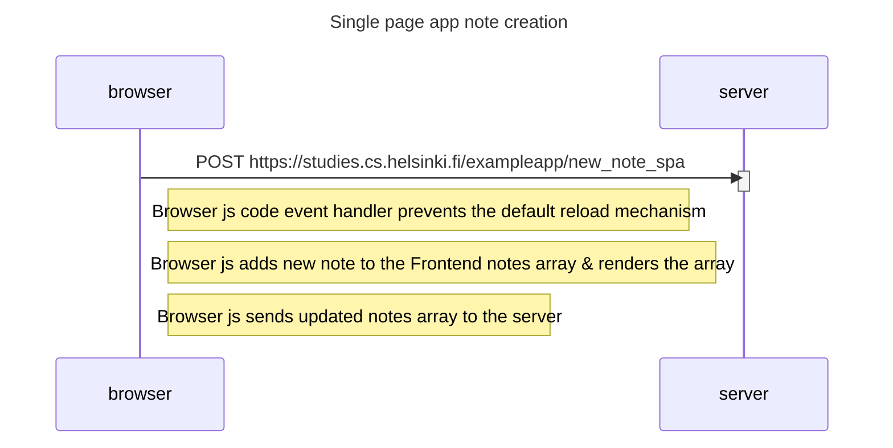

```mermaid
sequenceDiagram
    title Single page app note creation
    participant browser
    participant server

    browser->>server: POST https://studies.cs.helsinki.fi/exampleapp/new_note_spa
    activate server
    deactivate server
    Note right of browser: Browser js code event handler prevents the default reload mechanism
    Note right of browser: Browser js adds new note to the Frontend notes array & renders the array
    Note right of browser: Browser js sends updated notes array to the server
```